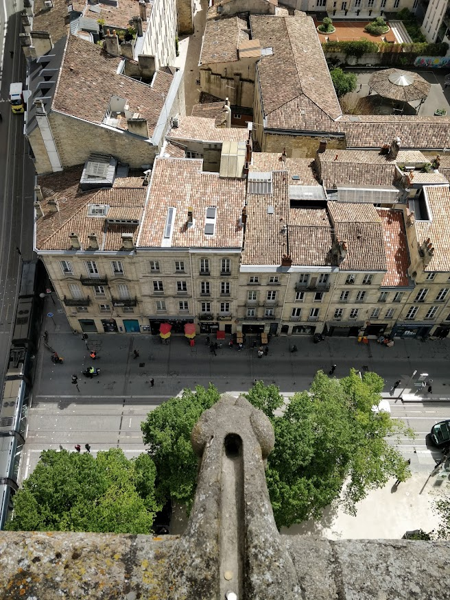
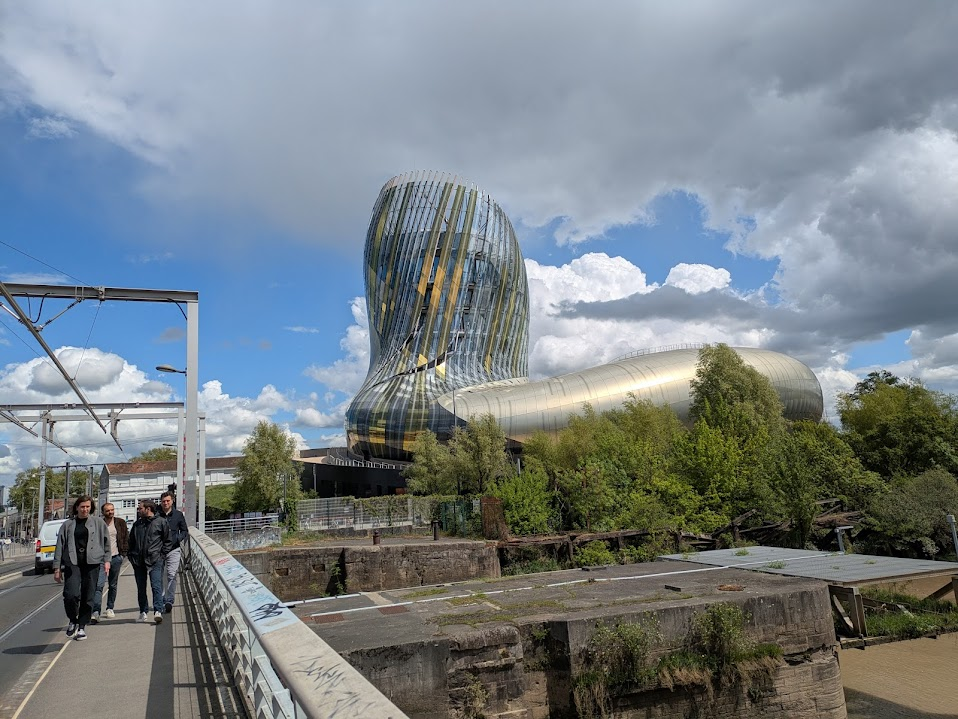
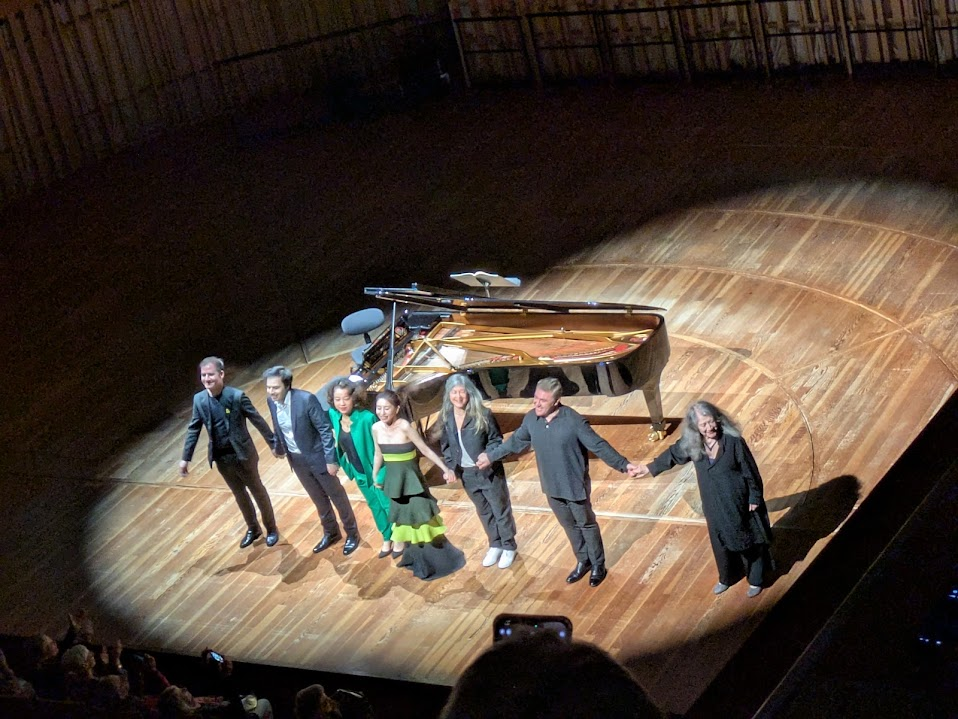
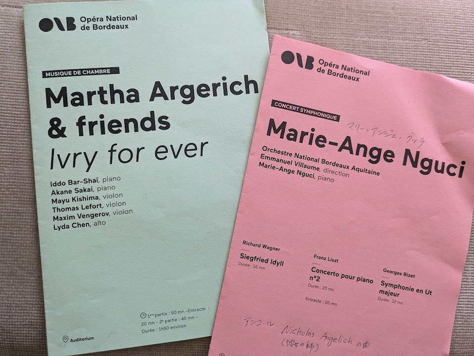
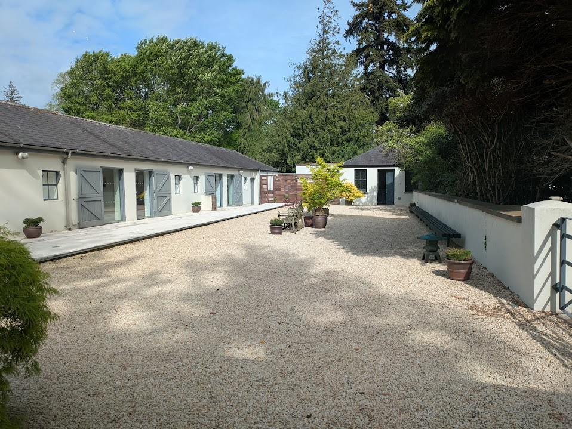
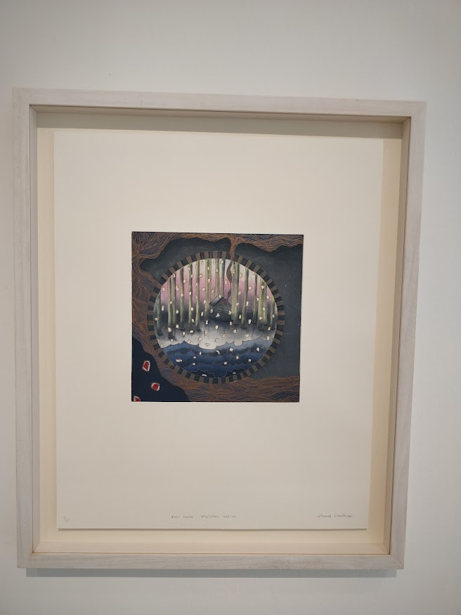
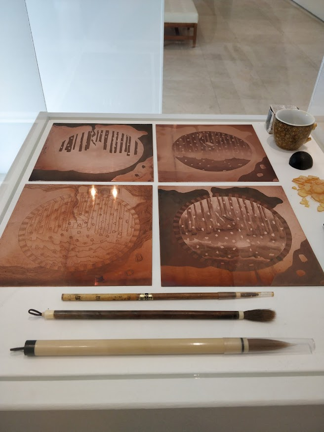

+++
title =  "2015"
date = 2015-12-31T14:25:06Z
draft = false
featuredImage = ""
# hidden = true
omitDate = false
summary = "2025"
+++

Bordeaux

Marta Argerich

Experience Japan

Link to Chair


**Journey under the midnight sun** opens with a murder case and follows numerous characters over the subsequent years as you slowly close in on the culprit. One of my favourite thrillers of all time.

**Einstein** Looked up Walter Isaacson after reading his Steve Jobs biography and enjoyed this biography as well.

