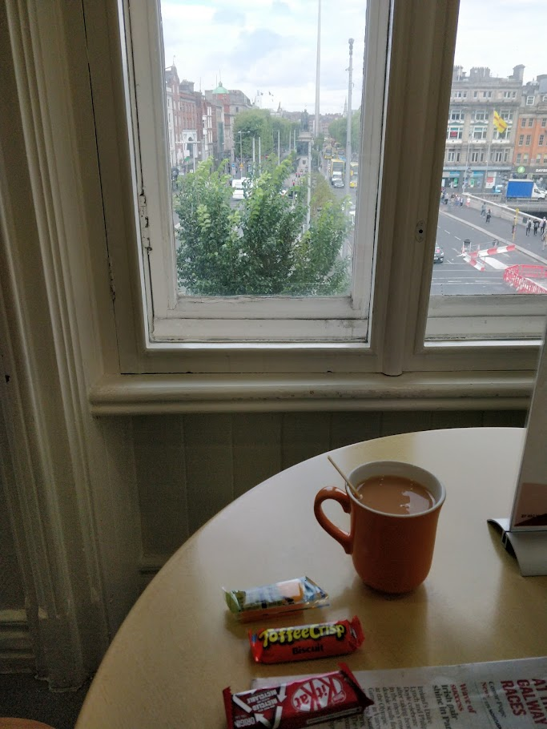
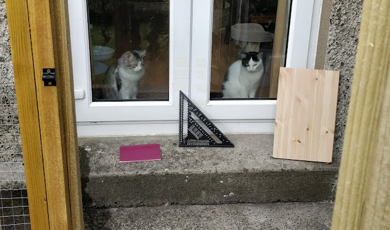
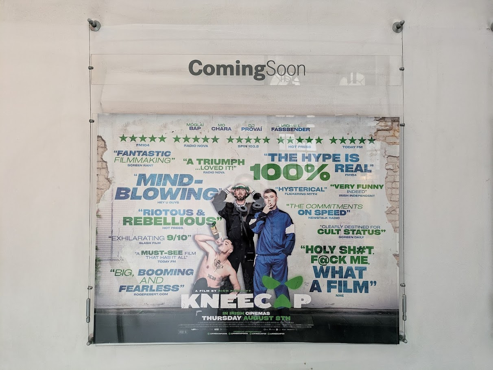
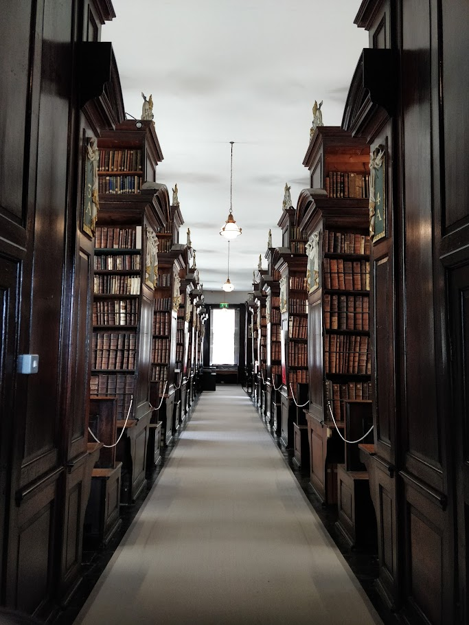
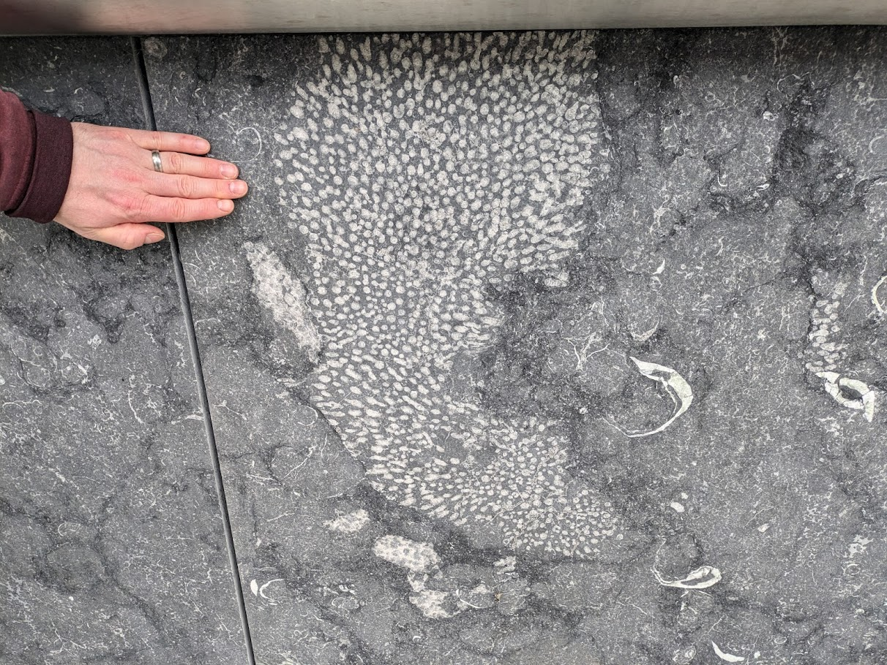
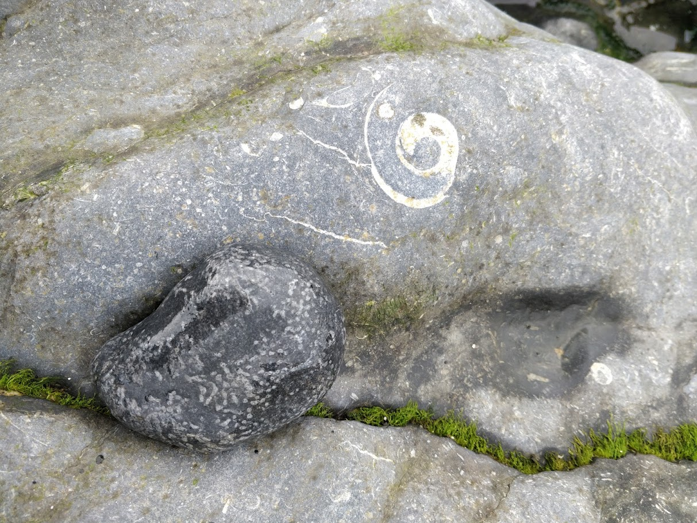
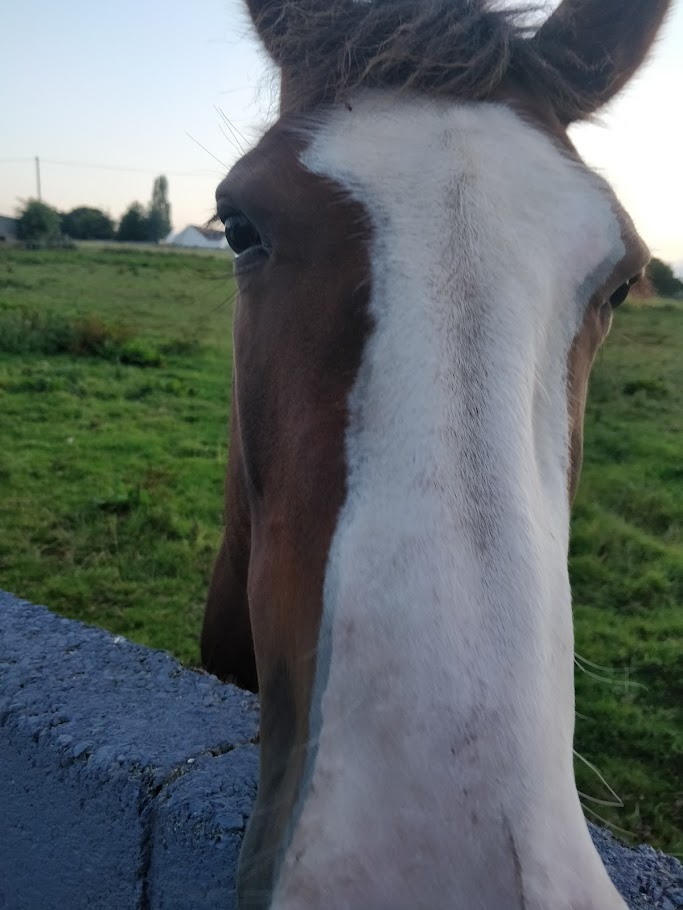
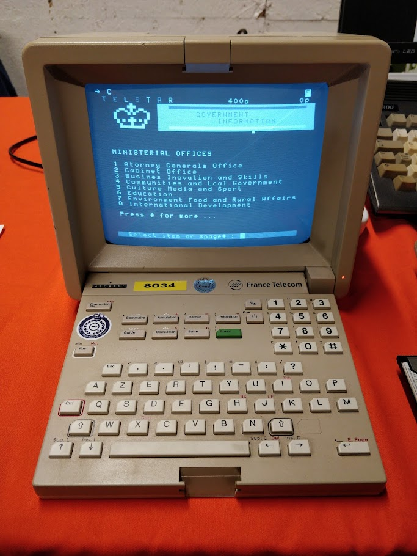

+++
title = "Autumn 2024"
date = 2024-08-01T17:05:15Z
draft = false
summary = "Kneecap and Dublin Fossils"
omitDate = true
+++

# August
### Blood Donation
The Clinic on D'Olier Street has a nice view of O' Connell Street. And snacks.

### Catio shelves
Made some small additions to a friend's catio

### Kneecap
Incredibly good fun. 
Nílim liofa ar chor ar bith ach bhain mé an taineamh as. Bhreathnaigh mé air faoi dhó.

### Marsh's Library
As part of a guided tour I visited St Patrick's Cathedral and the adjacent library.

### Fossil Walks
One walk through Dublin city looking at fossils visible in stonework and pavements.

A second walk on Portmarnock beach to try and see fossils in a more natural environment. Lithostration and brachiopods.

# September
### Met a horse

### Retro Computing Meetup

Lots of cool retro tech hosted by [Tog](https://tog.ie)

### New Ross Piano Festival
* [Yukine Kuroki](https://www.yukinekuroki.com/)
* [Paul Lewis](https://www.paullewispiano.co.uk/)

Cafés and the local library were used as venues during the festival so there was always somewhere to go for music.

### Bandsaw
Did some repairs in the hackerspace and got the bandsaw working.
# October
### Woodworking
College projects.

