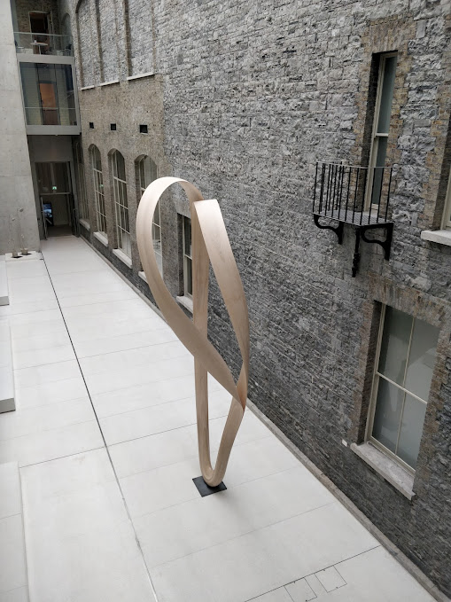
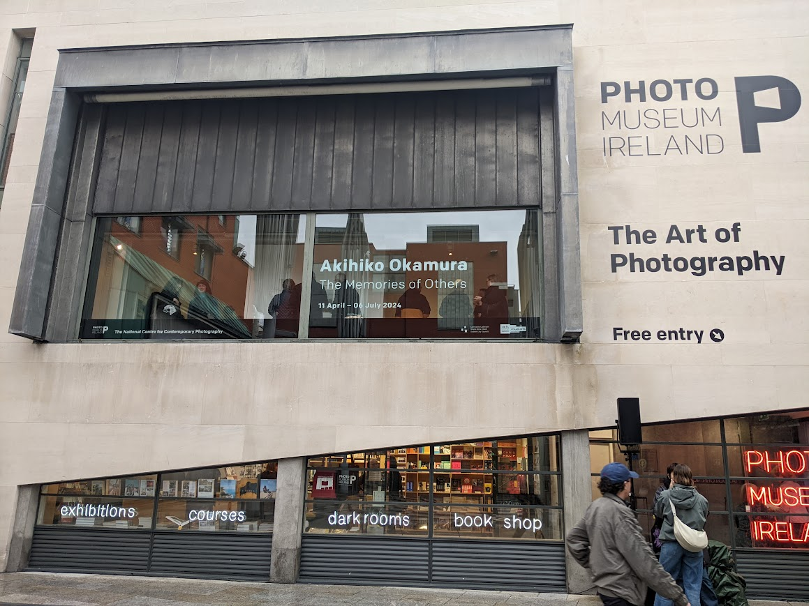

+++
title = "Spring 2024"
date = 2024-02-05T17:05:15Z
draft = false
summary = "Joseph Walsh lecture, Evil does not exist"
omitDate = true
+++
## March
### Romantic Classics with the RTÉ Concert Orchestra
March 6th National Concert Hall

[Alim Beisembayev](https://www.alimbeisembayev.co.uk/) conducted by [Kerem Hasan](https://www.keremhasan.com/)
* Rossini - William Tell Overture 
* Sergei Rachmaninov - Piano Concerto No. 2 in C Minor 
* Edward Elgar - Enigma Variations 

### Evil does not Exist
Written and directed by Ryusuke Hamaguchi.

### Joseph Walsh Talk 
April 21st in the National Gallery.

Walsh has designed a number of amazing art and furniture pieces. 

A bed he designed for Chatsworth house in England gave rise to a running joke. Guests would come downstairs for breakfast and declare "I slept in Joseph's bed last night."

[Joseph Walsh](https://josephwalshstudio.com) is a woodworker and artist based in County Cork.
## April 
### Akihiko Okamura - The Memories of Others
An exhibition opening in the Photo Museum Ireland showcasing pictures of Ireland taken by a Japanese photographer.
He photographed scenes from the Troubles in Northern Ireland.

 [Write up by The Guardian](https://www.theguardian.com/artanddesign/2024/apr/07/akihiko-okamura-photographs-troubles-northern-ireland-memories-of-others-exhibition) 

