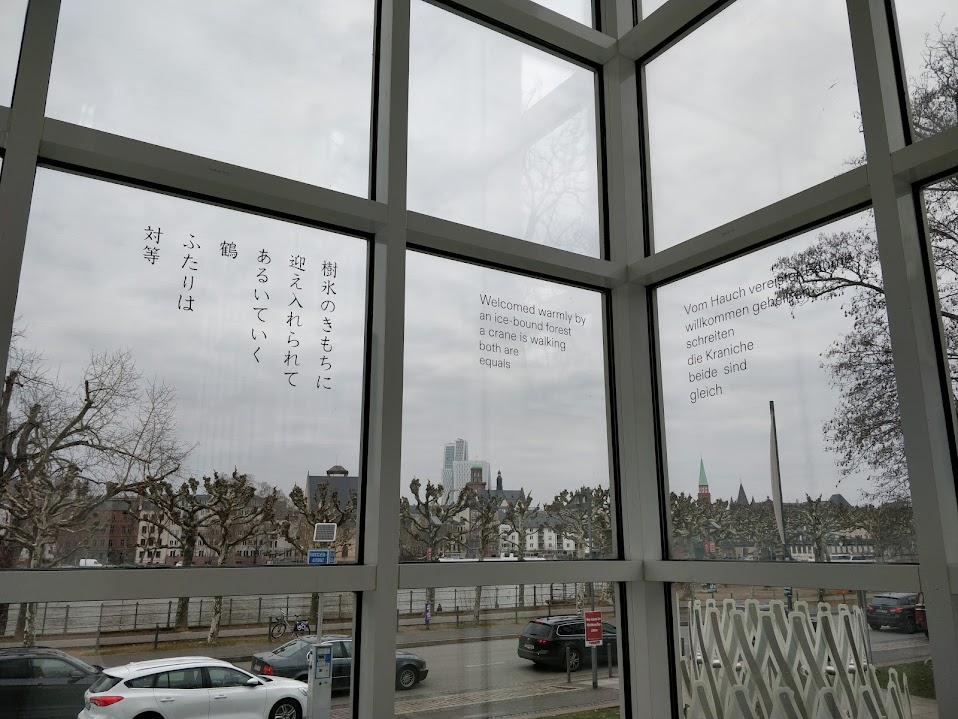

+++
title = 'Frankfurt'
date = 2025-06-28T20:06:02+01:00
draft = true
summary = "Frankfurt Am Main"
showTableOfContents = true

+++

<!--


 on [Unsplash](https://unsplash.com/)")

-->
### Museum of Applied Art
Museum Angewandte kunst had an exhibition of Japanese art

")

### 